# Projeto Trail — Arquitetura e Diagramas Consolidados do MVP- Evolução incremental, sem overengineering

---

# 1. 📊 Diagrama ER — Modelo de Dados do MVP

O diagrama ER representa as entidades persistidas no sistema e os seus relacionamentos principais.

Este modelo deve orientar:
- criação das entidades no backend
- mapeamento com Entity Framework Core
- migrations
- validação de PRs relacionados ao banco

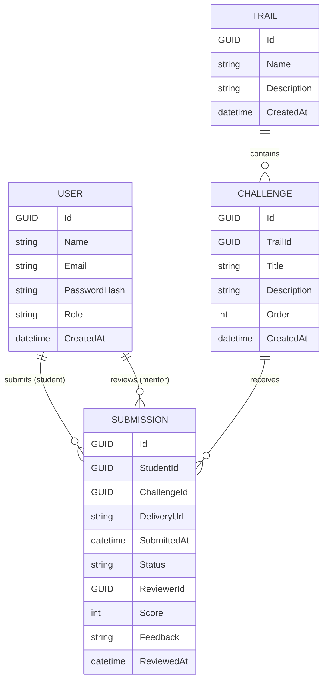

## 1.1 Leituras importantes do modelo

### USER
Representa qualquer usuário do sistema:
- estudante
- mentor
- gestor

### TRAIL
Representa a trilha de aprendizagem.

### CHALLENGE
Representa os desafios da trilha.

### SUBMISSION
É a entidade central do MVP.  
Ela concentra:
- a entrega do estudante
- o status da entrega
- os dados de avaliação
- os timestamps necessários para cálculo dos KPIs

### Decisão intencional do MVP
No MVP, **a avaliação está embutida na própria SUBMISSION**.

Isso evita:
- criação prematura de uma entidade Review
- complexidade desnecessária
- excesso de joins

---

# 2. 🔄 Diagrama de Fluxo — Visão Funcional do Sistema

Este diagrama apresenta o fluxo funcional ponta a ponta do MVP.

Ele mostra, em alto nível, como o sistema entrega valor para:
- estudantes
- mentores
- gestores

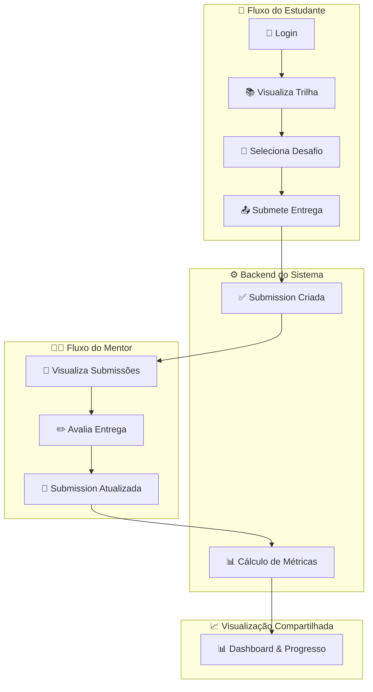

## 2.1 O que este fluxo mostra

- O estudante inicia a jornada pelo login
- A trilha e os desafios são consumidos pelo frontend a partir do backend
- A submissão de entrega cria a entidade central do sistema
- O mentor atua sobre as submissões
- As métricas surgem a partir da atualização da submissão
- O dashboard é o reflexo final do fluxo operacional

---

# 3. 🔐 Diagramas de Sequência — Fluxos Técnicos do MVP

A seguir estão os diagramas de sequência que detalham **como frontend, backend e banco interagem ao longo do tempo**.

Cada diagrama cobre uma parte específica do MVP.

---

## 3.1 Diagrama de Sequência — Login do Usuário (MVP‑01)

Este fluxo descreve o processo de autenticação com JWT.

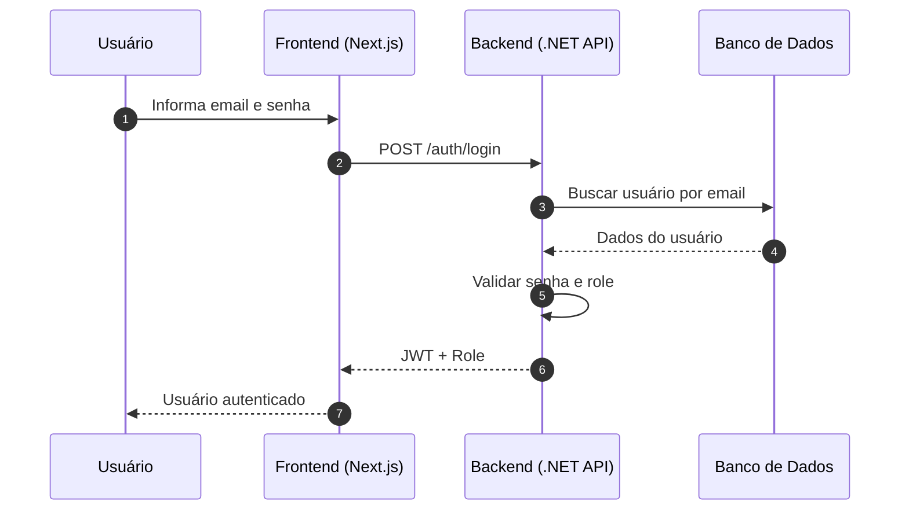

### Observações
- O frontend não valida credenciais
- O backend valida senha e perfil
- O JWT retornado passa a ser usado nas próximas requisições

---

## 3.2 Diagrama de Sequência — Autorização por Perfil (MVP‑01)

Este fluxo detalha como o backend usa o JWT para autorizar acesso.

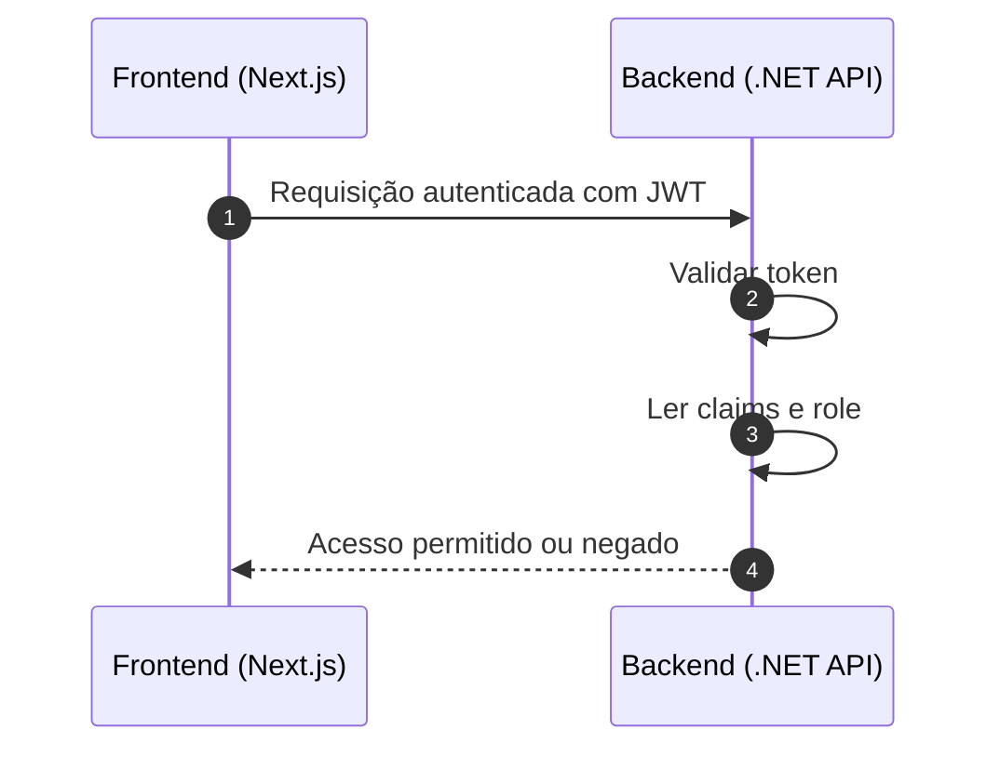

### Observações
- Autorização é responsabilidade do backend
- O frontend apenas reage ao resultado
- A role do usuário define o que ele pode acessar

---

## 3.3 Diagrama de Sequência — Visualização da Trilha e Desafios (MVP‑02)

Este fluxo cobre a leitura da trilha e de seus desafios pelo estudante.

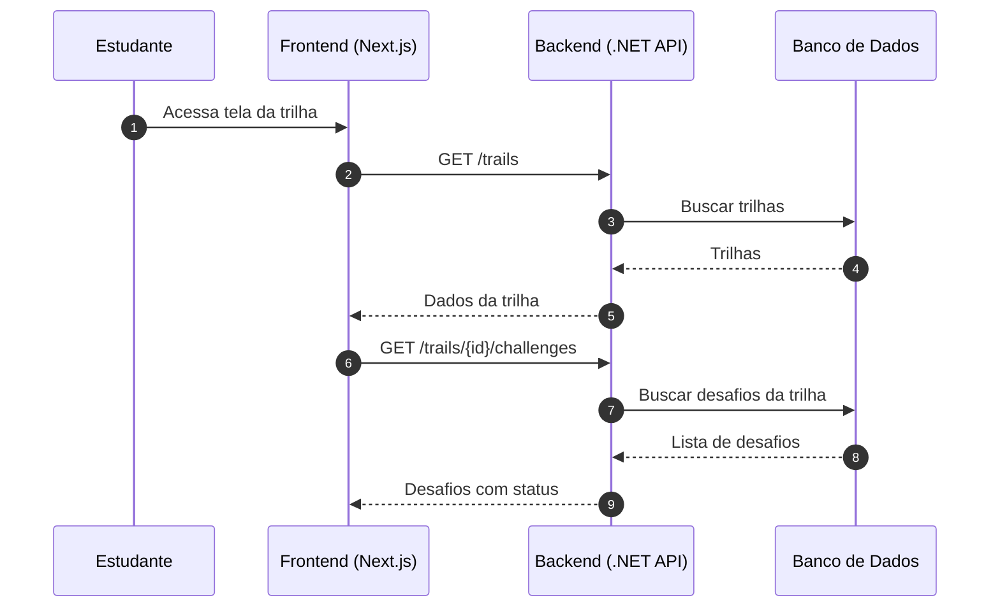

### Observações
- O backend consulta trilhas e desafios no banco
- O frontend exibe os dados sem recalcular regra de negócio
- O status exibido deve refletir dados reais do progresso

---

## 3.4 Diagrama de Sequência — Submissão de Entrega (MVP‑03)

Este fluxo representa o nascimento da entidade **SUBMISSION**.

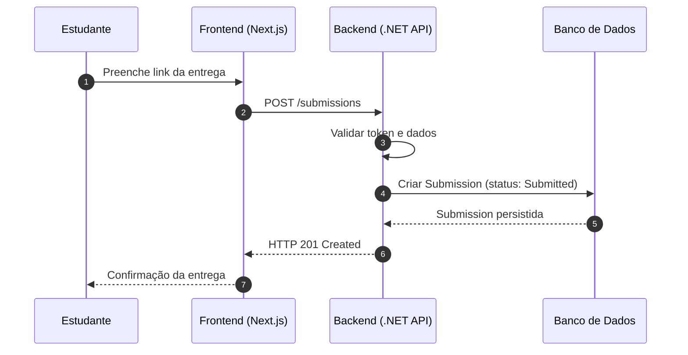

### Observações
- O campo `SubmittedAt` nasce neste momento
- O status inicial da entrega é `Submitted`
- A submissão é a base do fluxo de avaliação e métricas

---

## 3.5 Diagrama de Sequência — Listagem de Submissões para o Mentor (MVP‑04)

Este fluxo cobre a etapa em que o mentor acessa a fila de avaliações.

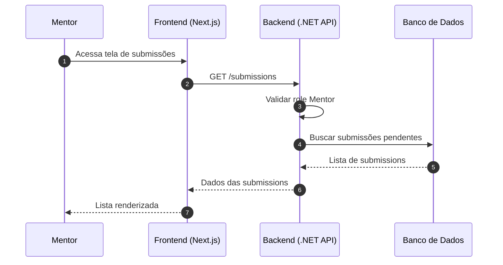

### Observações
- Apenas mentor deve acessar esse fluxo
- O backend deve validar a role antes de consultar o banco
- O frontend apenas renderiza a fila

---

## 3.6 Diagrama de Sequência — Avaliação e Feedback do Mentor (MVP‑04)

Este fluxo cobre a atualização da submissão com feedback e score.

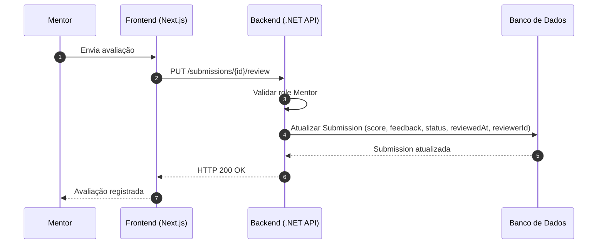

### Observações
- O momento da avaliação define o campo `ReviewedAt`
- O status da submissão é atualizado
- A partir daqui o sistema já possui dados suficientes para KPIs

---

## 3.7 Diagrama de Sequência — Snapshot / Progresso do Estudante (MVP‑02 + MVP‑03 + MVP‑04)

Este fluxo mostra a visão consolidada do progresso do estudante.

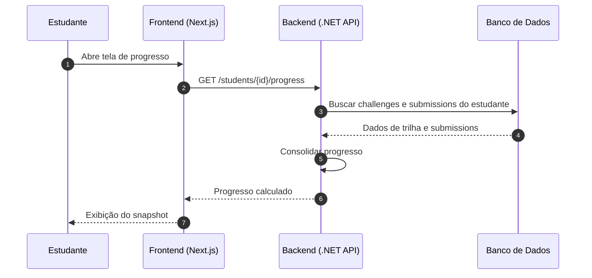

### Observações
- Este fluxo apoia a visão do estudante sobre sua jornada
- O backend deve consolidar o progresso a partir de dados reais
- O frontend apenas apresenta o resultado

---

## 3.8 Diagrama de Sequência — Cálculo de KPIs Operacionais (MVP‑05)

Este fluxo descreve o cálculo dos indicadores operacionais.

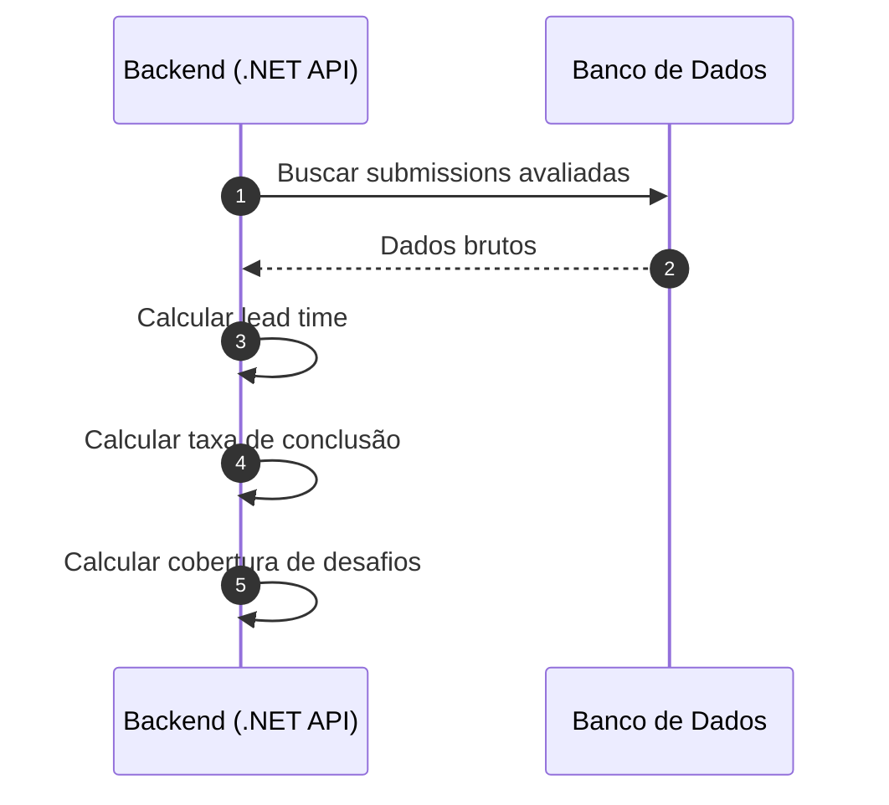

### Observações
- KPIs são calculados no backend
- Não existe tabela própria para métricas no MVP
- O cálculo deve refletir sempre os dados mais recentes

---

## 3.9 Diagrama de Sequência — Dashboard e Visualização dos KPIs (MVP‑05)

Este fluxo mostra a entrega final dos indicadores ao frontend.

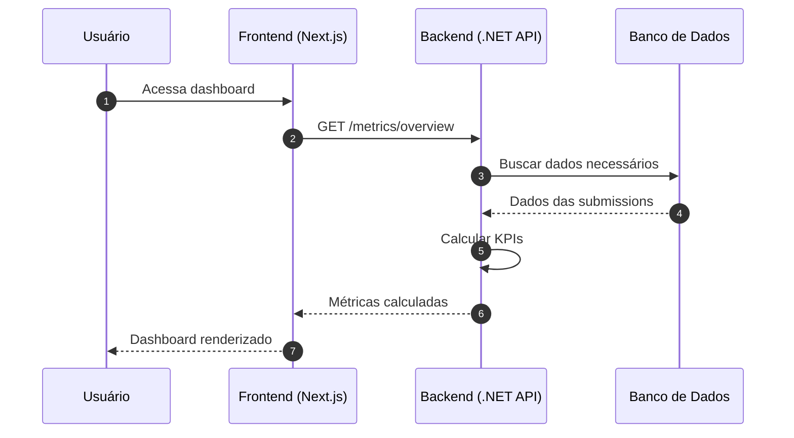

### Observações
- O frontend não recalcula métricas
- O backend entrega os KPIs já consolidados
- O dashboard é consequência de todo o fluxo anterior

---

# 4. ✅ Regras Arquiteturais do MVP

Para manter consistência entre código e domínio, o MVP deve obedecer às seguintes regras:

- O frontend **não implementa regra de negócio**
- O backend centraliza:
  - validações
  - segurança
  - cálculo de métricas
  - orquestração do fluxo
- O banco guarda apenas:
  - dados de domínio
  - timestamps necessários
- KPIs são sempre **derivados**, nunca persistidos no MVP

---

## 📌 Regra de Ouro do Projeto

> Se um endpoint, serviço, tela ou regra  
> não aparece em pelo menos um diagrama deste documento,  
> ele deve ser questionado antes de entrar no MVP.

---

# 5. 🚀 Como este documento deve ser usado

Este documento deve ser usado como referência para:

- criação das entidades
- criação de endpoints
- organização de frontend e backend
- revisão de pull requests
- discussão de bugs e divergências
- mentoria técnica
- onboarding de novos participantes

---

## ✅ Encerramento

Este documento consolida a arquitetura do MVP em sua forma atual.
A partir dele, o projeto está apto a evoluir com consistência técnica e clareza funcional.

Este documento consolida, em um único artefato, os diagramas oficiais do MVP do **Projeto Trail**.

Ele reúne:
- **Modelo de Dados (ER)**
- **Fluxo Funcional do Sistema**
- **Diagramas de Sequência completos do MVP**

Este material deve ser usado como:
- referência arquitetural oficial
- base para alinhamento técnico
- apoio à implementação do MVP
- apoio para revisão de código
- artefato de onboarding para novos participantes

---

## 🎯 Objetivo deste Documento

Garantir que todos os envolvidos no projeto tenham uma visão consistente sobre:

- quais entidades existem
- como elas se relacionam
- como o sistema se comporta
- como frontend, backend e banco interagem
- como os principais fluxos do MVP acontecem ponta a ponta

---

## 🧭 Visão Geral da Arquitetura

A arquitetura do MVP foi definida com foco em simplicidade, clareza e viabilidade de implementação.

### Stack adotada
- **Frontend:** Next.js
- **Backend:** ASP.NET Core (.NET API)
- **Persistência:** SQL Server com Entity Framework Core
- **Autenticação:** JWT
- **Nuvem:** Azure

### Princípios arquiteturais
- Simplicidade antes de sofisticação
- Regras de negócio centralizadas no backend
- Frontend orientado à experiência e consumo de API
- KPIs calculados dinamicamente, sem persistência redundante
