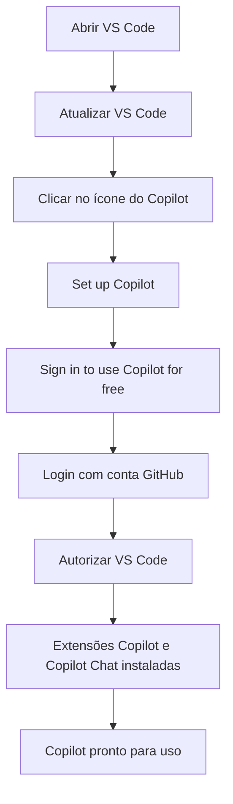
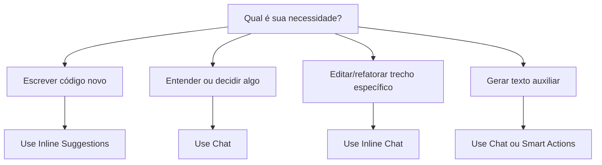
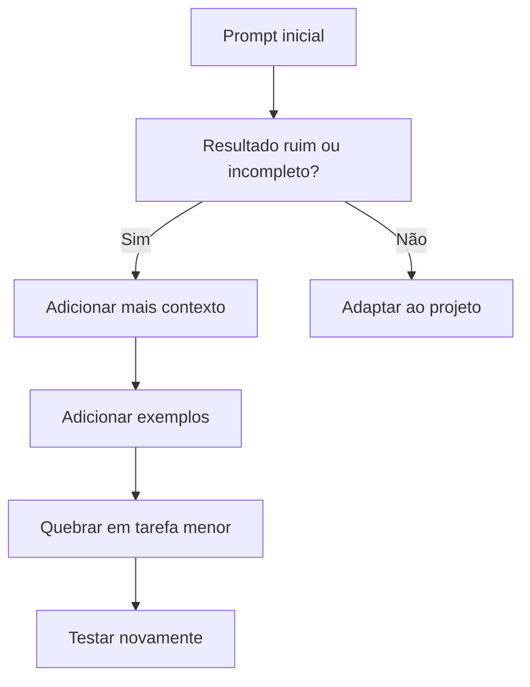

## Guia Completo — GitHub Copilot Free no VS Code para o Projeto Trail

**Objetivo deste guia**  
Ajudar cada aluno a **configurar, entender e usar o GitHub Copilot Free no VS Code** de forma **clara, prática e produtiva** durante o desenvolvimento do MVP do Projeto Trail.  
Este guia cobre:
- configuração
- fluxo de uso
- cenários práticos
- melhores práticas
- prompts prontos
- uso para código, testes, documentação, commits e PRs

---

## 1. Visão rápida: o que você vai ganhar com este guia

Ao final deste material, você deve ser capaz de:
- Instalar e ativar o GitHub Copilot Free no VS Code
[Guia oficial: GitHub Copilot Free no VS Code](https://code.visualstudio.com/blogs/2024/12/18/free-github-copilot) [Tutorial: habilitar Copilot no VS Code](https://microsoftlearning.github.io/mslearn-github-copilot-dev/Instructions/Labs/LAB_AK_00_enable_github_copilot_in_visual_studio_code.html)
- Entender o que o plano gratuito inclui e quais são seus limites
[Visão geral do plano Free no VS Code](https://code.visualstudio.com/blogs/2024/12/18/free-github-copilot) 
[Planos e limites do GitHub Copilot](https://docs.github.com/en/copilot/get-started/plans)
- Escolher o **modo certo** do Copilot para cada tarefa (sugestão inline, chat, inline chat, smart actions)
[Visão geral do Copilot no VS Code](https://code.visualstudio.com/docs/copilot/overview) 
[Boas práticas de uso de IA no VS Code](https://code.visualstudio.com/docs/copilot/best-practices)
- Usar prompts melhores para obter respostas melhores 
[Prompt engineering para GitHub Copilot](https://docs.github.com/en/copilot/concepts/prompting/prompt-engineering) 
[Introdução ao prompt engineering com GitHub Copilot](https://learn.microsoft.com/en-us/training/modules/introduction-prompt-engineering-with-github-copilot/)
- Acelerar o trabalho em:
    - Backend
    - Frontend
    - Banco / EF Core
    - Testes
    - Documentação
    - Commits e PRs 
    [Boas práticas de uso de IA no VS Code](https://code.visualstudio.com/docs/copilot/best-practices) 
    [Tutorial completo: build, debug, review e ship com Copilot](https://github.blog/ai-and-ml/github-copilot/a-developers-guide-to-writing-debugging-reviewing-and-shipping-code-faster-with-github-copilot/)
    - Trabalhar com IA sem perder controle do código, nem da qualidade 
    [Boas práticas de uso de IA no VS Code](https://code.visualstudio.com/docs/copilot/best-practices) 
    [Visão geral do Copilot no VS Code](https://code.visualstudio.com/docs/copilot/overview)

---    

## 2. O que é o GitHub Copilot Free

O **GitHub Copilot Free** é um plano gratuito do GitHub Copilot disponível para desenvolvedores individuais no VS Code. A documentação oficial informa que você pode ativá-lo **sem assinatura paga, sem teste e sem cartão de crédito**, usando apenas uma conta GitHub. 
[Guia oficial: GitHub Copilot Free no VS Code](https://code.visualstudio.com/blogs/2024/12/18/free-github-copilot)
[Planos e limites do GitHub Copilot](https://docs.github.com/en/copilot/get-started/plans)

### 2.1 O que o plano gratuito inclui

Segundo a documentação oficial atual, o plano **Free** inclui:
- **2.000 completions por mês**
- **50 agent mode ou chat requests por mês**
- Acesso a modelos como **Haiku 4.5, GPT‑5 mini e outros**
- Uso do Copilot em editores suportados, incluindo **VS Code** 
[Planos e limites do GitHub Copilot](https://docs.github.com/en/copilot/get-started/plans)

**Leitura prática para o Projeto Trail**  
Esse volume é suficiente para o MVP se você usar com foco e evitar desperdiçar prompts em perguntas vagas. 
[Planos e limites do GitHub Copilot](https://docs.github.com/en/copilot/get-started/plans) 
[Prompt engineering para GitHub Copilot](https://docs.github.com/en/copilot/concepts/prompting/prompt-engineering)

---

## 3. Arquitetura mental: como pensar no Copilot

O Copilot **não substitui o desenvolvedor**. Ele é um **acelerador**. 

A documentação do VS Code descreve o Copilot como um conjunto de modos diferentes:
- sugestões inline
- chat
- inline chat
- agentes
- smart actions 
[Visão geral do Copilot no VS Code](https://code.visualstudio.com/docs/copilot/overview) 
[Boas práticas de uso de IA no VS Code](https://code.visualstudio.com/docs/copilot/best-practices)

Já o material interno GitHub Copilot - Avanade.pptx reforça que o Copilot:
- facilita a escrita de código
- aumenta a produtividade
- reduz erros
- ajuda a encontrar melhores práticas 
[Visão geral do Copilot no VS Code](https://code.visualstudio.com/docs/copilot/overview)

### 3.1 Modelo mental recomendado

**Copilot = par programador rápido**  
Você continua sendo o responsável por:
- entender
- revisar
- adaptar ao domínio
- testar
- commitar

---

## 4. Como configurar o GitHub Copilot Free no VS Code

### 4.1 Pré-requisitos

Você precisa de:
- VS Code instalado
- conta GitHub pessoal
- acesso à internet
- extensões do Copilot no VS Code [Tutorial: habilitar Copilot no VS Code](https://microsoftlearning.github.io/mslearn-github-copilot-dev/Instructions/Labs/LAB_AK_00_enable_github_copilot_in_visual_studio_code.html) [Guia oficial: GitHub Copilot Free no VS Code](https://code.visualstudio.com/blogs/2024/12/18/free-github-copilot)

### 4.2 Passo a passo de ativação

A documentação do Microsoft Learn descreve o processo assim:
- Abrir o **VS Code**
- Garantir que o VS Code esteja atualizado
- No **Status Bar**, passar o mouse sobre o ícone do Copilot e escolher **Set up Copilot**
- Na tela **Sign in to use Copilot for free**, clicar em **Sign in**
- Entrar com sua conta GitHub no navegador
- Autorizar o VS Code
- Voltar ao editor e confirmar que as extensões **GitHub Copilot** e **GitHub Copilot Chat** aparecem instaladas [Tutorial: habilitar Copilot no VS Code](https://microsoftlearning.github.io/mslearn-github-copilot-dev/Instructions/Labs/LAB_AK_00_enable_github_copilot_in_visual_studio_code.html)

### 4.3 Fluxo visual de configuração



### 4.4 Checklist rápido de configuração
- VS Code atualizado
- Conta GitHub criada
- GitHub Copilot instalado
- GitHub Copilot Chat instalado
- Login concluído com sucesso
- Primeiro teste de chat realizado

---

## 5. Os modos do Copilot no VS Code — quando usar cada um

A documentação de boas práticas do VS Code recomenda **escolher a ferramenta certa para a tarefa**. Ela apresenta esta lógica:
- **Inline suggestions** → para manter o fluxo enquanto você escreve
- **Ask (chat)** → para perguntas, brainstorming e exploração
- **Inline chat** → para edições localizadas no código
- **Agents** → para mudanças multi-arquivo mais autônomas
- **Smart actions** → para tarefas especializadas como geração de commit messages e correções rápidas 
[Boas práticas de uso de IA no VS Code](https://code.visualstudio.com/docs/copilot/best-practices)

### 5.1 Tabela de decisão rápida

| Situação | Melhor modo | Exemplo |
| --- | --- | --- |
| Escrever DTO, classe, enum | Inline suggestions | Começar a classe e deixar o Copilot completar.<br>[Visão geral do Copilot no VS Code](https://code.visualstudio.com/docs/copilot/overview)<br>[Boas práticas de uso de IA no VS Code](https://code.visualstudio.com/docs/copilot/best-practices) |
| Entender erro de compilação | Chat | “Explique este erro e sugira correção”.<br>[Visão geral do Copilot no VS Code](https://code.visualstudio.com/docs/copilot/overview)<br>[Boas práticas de uso de IA no VS Code](https://code.visualstudio.com/docs/copilot/best-practices) |
| Refatorar uma função específica | Inline chat | Selecionar trecho e pedir simplificação/refatoração.<br>[Visão geral do Copilot no VS Code](https://code.visualstudio.com/docs/copilot/overview)<br>[Boas práticas de uso de IA no VS Code](https://code.visualstudio.com/docs/copilot/best-practices) |
| Planejar uma feature maior | Plan / Chat | Quebrar tarefa em passos menores.<br>[Visão geral do Copilot no VS Code](https://code.visualstudio.com/docs/copilot/overview)<br>[Boas práticas de uso de IA no VS Code](https://code.visualstudio.com/docs/copilot/best-practices) |
| Gerar mensagem de commit | Smart actions / Chat | “Resuma estas mudanças em 1 linha”.<br>[Boas práticas de uso de IA no VS Code](https://code.visualstudio.com/docs/copilot/best-practices) |

### 5.2 Fluxo visual — escolha do modo certo


---

## 6. Regras de ouro para usar o Copilot bem

A documentação oficial de prompt engineering do GitHub recomenda:
- começar com um objetivo geral e depois adicionar requisitos específicos
- dar exemplos
- quebrar tarefas grandes em tarefas menores
- evitar ambiguidade 
[Prompt engineering para GitHub Copilot](https://docs.github.com/en/copilot/concepts/prompting/prompt-engineering) [Introdução ao prompt engineering com GitHub Copilot](https://learn.microsoft.com/en-us/training/modules/introduction-prompt-engineering-with-github-copilot/) 

Material que reforça que ganhos com GenAI **devem ser acompanhados**, e que as limitações variam conforme o contexto do trabalho. 
[Boas práticas de uso de IA no VS Code](https://code.visualstudio.com/docs/copilot/best-practices) 
[Tutorial completo: build, debug, review e ship com Copilot](https://github.blog/ai-and-ml/github-copilot/a-developers-guide-to-writing-debugging-reviewing-and-shipping-code-faster-with-github-copilot/)

### 6.1 Regra prática do projeto

**Nunca faça commit de código que você não consegue explicar.**

### 6.2 Fluxo obrigatório de uso


### 6.3 O que NÃO fazer
- usar prompts vagos como “faz aí”
- aceitar código sem ler
- colar segredos, tokens ou strings de conexão
- pedir soluções gigantescas de uma vez
- depender do Copilot para entender o domínio por você

---

## 7. Prompt engineering: como escrever prompts melhores

O GitHub Docs recomenda explicitamente:
- **Start general, then get specific**
- **Give examples**
- **Break complex tasks into simpler tasks**
- **Avoid ambiguity** 
[Prompt engineering para GitHub Copilot](https://docs.github.com/en/copilot/concepts/prompting/prompt-engineering)

### 7.1 Estrutura recomendada de prompt

Use este modelo:
- **Contexto**
- **Objetivo**
- **Restrições**
- **Exemplos**
- **Critério de aceite**

#### Exemplo genérico

```text
Contexto:
Estou implementando a feature de submissão do Projeto Trail.

Objetivo:
Criar um endpoint POST /submissions em ASP.NET Core.

Restrições:
Usar EF Core, SQL Server, validar DeliveryUrl, status inicial Submitted.

Exemplo:
Request: StudentId, ChallengeId, DeliveryUrl
Response: Submission criada com Id e SubmittedAt

Critério de aceite:
Deve retornar 201 em caso de sucesso e 400 em caso de erro.
```

### 7.2 Antes e depois — prompt ruim x bom prompt

#### ❌ Prompt fraco
```text
Cria um endpoint de submission
```

#### ✅ Prompt forte
```text
Crie um endpoint POST /submissions em ASP.NET Core para o Projeto Trail.
O endpoint deve receber StudentId, ChallengeId e DeliveryUrl.
Valide campos obrigatórios e DeliveryUrl.
Salve os dados com EF Core em SQL Server.
Defina Status = Submitted e SubmittedAt = DateTime.UtcNow.
Retorne 201 com o objeto criado.
```

### 7.3 Fluxo de melhoria de prompt


---

## 8. Como usar o Copilot no Projeto Trail — por área

### 8.1 Backend (.NET / API / EF Core)

#### O Copilot ajuda muito em:
- entidades
- DTOs
- enums
- endpoints
- controllers
- services
- validações simples
- testes unitários básicos 
[Visão geral do Copilot no VS Code](https://code.visualstudio.com/docs/copilot/overview) 
[Boas práticas de uso de IA no VS Code](https://code.visualstudio.com/docs/copilot/best-practices) 
[Visão geral do Copilot no VS Code](https://code.visualstudio.com/docs/copilot/overview)

#### Cenários ideais
- criar User, Trail, Challenge, Submission
- rascunhar POST /auth/login
- rascunhar POST /submissions
- explicar erro de DI, EF Core ou validação

#### Exemplo de prompt — entidade
```text
Crie a entidade Submission em C# com os campos:
Id, StudentId, ChallengeId, DeliveryUrl, SubmittedAt, Status, ReviewerId, Score, Feedback, ReviewedAt.
Use tipos apropriados para EF Core.
```

#### Exemplo de prompt — endpoint
```text
Crie um endpoint POST /submissions em ASP.NET Core.
Recebe StudentId, ChallengeId, DeliveryUrl.
Valida os dados.
Salva a entidade Submission no banco usando EF Core.
Retorna 201 Created.
```

#### Exemplo de prompt — explicar erro
```text
Explique por que este erro de EF Core acontece e sugira a menor correção possível.
```

### 8.2 Frontend (Next.js)

#### O Copilot ajuda muito em:
- componentes
- pages / routes
- formulários
- consumo de API
- loading / error states
- pequenos refactors 
[Visão geral do Copilot no VS Code](https://code.visualstudio.com/docs/copilot/overview) [Boas práticas de uso de IA no VS Code](https://code.visualstudio.com/docs/copilot/best-practices)

#### Cenários ideais
- criar tela de login
- criar tela da trilha
- criar formulário de submissão
- mapear dados vindos da API

#### Exemplo de prompt — tela de login
```text
Crie uma página de login em Next.js com email e senha.
Ao submeter, chame POST /auth/login.
Se der sucesso, salve o token e redirecione.
Se der erro, mostre mensagem simples.
```

#### Exemplo de prompt — listagem de desafios
```text
Crie um componente React para listar desafios da trilha.
Cada item deve mostrar título, descrição curta e status.
```

### 8.3 Banco de Dados / EF Core / Migrations

#### O Copilot ajuda muito em:
- classes de entidades
- configuração de DbContext
- relacionamento entre tabelas
- helpers de migration
- conferência de consistência do modelo 
[Visão geral do Copilot no VS Code](https://code.visualstudio.com/docs/copilot/overview) [Visão geral do Copilot no VS Code](https://code.visualstudio.com/docs/copilot/overview)

#### Cenários ideais
- gerar rascunho de DbSet<>
- revisar chaves estrangeiras
- sugerir nomes mais claros

#### Exemplo de prompt
```text
Analise estas entidades e sugira se os relacionamentos estão coerentes:
User, Trail, Challenge, Submission.
```

### 8.4 Testes e debugging

A documentação oficial e os recursos de aprendizado destacam que o Copilot pode ajudar em:
- gerar testes
- explicar código
- identificar bugs
- propor correções [Visão geral do Copilot no VS Code](https://code.visualstudio.com/docs/copilot/overview) [Get Started with GitHub Copilot in VS Code](https://learn.microsoft.com/en-us/shows/visual-studio-code/get-started-with-github-copilot-in-vs-code) [Tutorial completo: build, debug, review e ship com Copilot](https://github.blog/ai-and-ml/github-copilot/a-developers-guide-to-writing-debugging-reviewing-and-shipping-code-faster-with-github-copilot/)

#### Cenários ideais
- gerar testes para service
- explicar por que request retorna 400
- sugerir hipótese para bug
- identificar onde o fluxo quebrou

#### Prompt — testes
```text
Gere testes unitários para o service de submissão cobrindo:
- sucesso
- DeliveryUrl
- campos obrigatórios
```